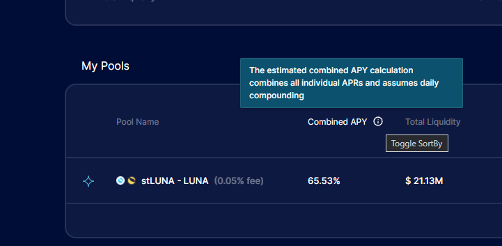
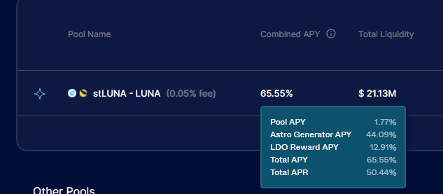

# ARC-1: Change From APYs to APRs on Astroport.fi

## Preamble
```
AIP#: 1
Title: Change From APYs to APRs on Astroport.fi
Author(s): @lex_node, @danku_r
Contributors:
Tags: general, ui
Type: UI
Category: Signaling (Non-Binding Social Consensus Signal)
Status: Accepted
Date Proposed: 2022-02-01
Date Ratified: 2022-02-01
Dependencies: n/a
Replaces: n/a
```
## References

- [astroport.fi](https://astroport.fi/)
- [Astroport Disclaimers and Disclosires](https://astroport.medium.com/astroport-disclaimers-38dee1f94300)
- [Terms and Conditions](https://astroport.fi/terms-and-conditions)
- [Astroport App](https://app.astroport.fi/pools)

## Summary

We suggest switching from an APY display to an APR display and making more of the assumptions involved in calculating APRs and APYs apparent on the UI.

## Abstract


## Motivation

Currently, the primary displayed token reward rate for each pool is a “Combined APY” figure. Hovering your cursor over the adjacent information bubble describes this as an “estimated Combined APY calculation” which “combines all individual APRs and assumes daily compounding.”:



Hovering your cursor over a given “Combined APY” figure yields a list of other APYs and a “Total APR”:



The Astroport website Terms and Conditions state the following:


In turn, the Astroport Disclaimers and Disclosures 1 set forth a series of explanations of how APYs and APRs are calculated and state that they are unlikely to be accurate, including because the APYs assume daily compounding, when in fact the Astroport protocol only compounds Pool APR:


Although this explanation is helpful, it is not directly linked in the UI. Furthermore, it raises the question of why APY displays are useful, considering they assume compounding but many users may not extrinsically compound.

## Implementation

Update the Astroport dashboard to calculate the APR for pool fees and dual rewards instead of using APY.

## Copyright

Copyright and related rights waived via [CC0](https://creativecommons.org/publicdomain/zero/1.0/).
