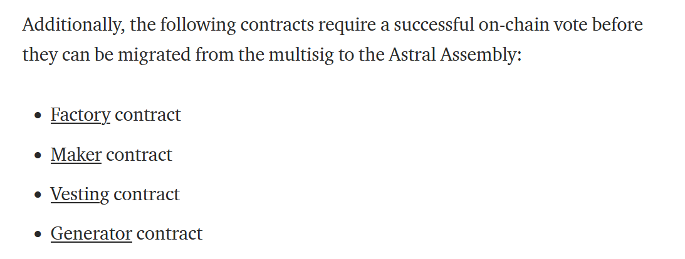

# ARC-11: Claim Assembly Ownership Over Four Core Astroport Contracts

## Preamble

```
AIP#: 11
Title: Claim Assembly Ownership Over Four Core Astroport Contracts
Author(s): @stefan
Contributors: n/a
Tags: general, assembly
Type: General
Category: Binding (Executable Purely On-Chain)
Status: Active
Date Proposed: 2022-04-07
Date Ratified:
Dependencies: n/a
Replaces: n/a
```

## References

- [Assembly Annuncement Medium Post](https://astroport.medium.com/the-dawn-of-the-astral-assembly-91e38517fbeb)
- [Factory Contract](https://terrasco.pe/mainnet/address/terra1fnywlw4edny3vw44x04xd67uzkdqluymgreu7g)
- [Generator Contract](https://terrasco.pe/mainnet/address/terra1zgrx9jjqrfye8swykfgmd6hpde60j0nszzupp9)
- [Generator Vesting Contract](https://terrasco.pe/mainnet/address/terra1hncazf652xa0gpcwupxfj6k4kl4k4qg64yzjyf)
- [Maker Contract](https://terrasco.pe/mainnet/address/terra12u7hcmpltazmmnq0fvyl225usn3fy6qqlp05w0)

## Summary

This proposal focuses on allowing the Columbus Assembly smart contract to claim ownership over four core Astroport contracts: the [Factory](https://terrasco.pe/mainnet/address/terra1fnywlw4edny3vw44x04xd67uzkdqluymgreu7g), the [Maker](https://terrasco.pe/mainnet/address/terra1fnywlw4edny3vw44x04xd67uzkdqluymgreu7g), the [Generator](https://terrasco.pe/mainnet/address/terra1zgrx9jjqrfye8swykfgmd6hpde60j0nszzupp9) and the [Generator Vesting](https://terrasco.pe/mainnet/address/terra1hncazf652xa0gpcwupxfj6k4kl4k4qg64yzjyf) contract.

## Abstract

As mentioned in the recent [Medium post](https://astroport.medium.com/the-dawn-of-the-astral-assembly-91e38517fbeb) that announced the Astroport Assembly launch, the Assembly contract needs a proposal in order to claim ownership over four core Astroport smart contracts:



This ownership claim is important so that future Assembly proposals can change parameters in these four contracts, such as creating new pool types and adjusting ASTRO emissions for different Astroport pairs.

## Motivation

In order for the community to be able to process all the AIPs that have been created to date as well as update other protocol parameters, the Assembly first needs to claim ownership over remaining core Astroport contracts that are currently deployed and functional on Columbus.

## Specification

This AIP proposes that the Assembly claims ownership over four core Astroport contracts. This can be achieved by creating a new Assembly proposal that executes four messages. Each of these messages is meant to claim ownership for the Assembly in one of the above mentioned Astroport core contracts.

## Implementation

Once the community has a chance to discuss on the forum and if the general sentiment is positive for this ARC, anyone can create a proposal in the Assembly contract and specify the following executable messages:

```
[
      {
        "order": "1",
        "msg": {
          "wasm": {
            "execute": {
              "contract_addr": "terra1fnywlw4edny3vw44x04xd67uzkdqluymgreu7g",
              "msg": "ewogICJjbGFpbV9vd25lcnNoaXAiOiB7fQp9",
              "funds": []
            }
          }
        }
      },
      {
        "order": "2",
        "msg": {
          "wasm": {
            "execute": {
              "contract_addr": "terra12u7hcmpltazmmnq0fvyl225usn3fy6qqlp05w0",
              "msg": "ewogICJjbGFpbV9vd25lcnNoaXAiOiB7fQp9",
              "funds": []
            }
          }
        }
      },
      {
        "order": "3",
        "msg": {
          "wasm": {
            "execute": {
              "contract_addr": "terra1hncazf652xa0gpcwupxfj6k4kl4k4qg64yzjyf",
              "msg": "ewogICJjbGFpbV9vd25lcnNoaXAiOiB7fQp9",
              "funds": []
            }
          }
        }
      },
      {
        "order": "4",
        "msg": {
          "wasm": {
            "execute": {
              "contract_addr": "terra1zgrx9jjqrfye8swykfgmd6hpde60j0nszzupp9",
              "msg": "ewogICJjbGFpbV9vd25lcnNoaXAiOiB7fQp9",
              "funds": []
            }
          }
        }
      }
]
```

These messages are meant to claim ownership for the Assembly over the Factory, Maker, Generator and Generator Vesting contracts. Note that `ewogICJjbGFpbV9vd25lcnNoaXAiOiB7fQp9` is the `base64` encoded version of the following JSON:

```
{
  "claim_ownership": {}
}
```

## Copyright

Copyright and related rights waived via [CC0](https://creativecommons.org/publicdomain/zero/1.0/).
