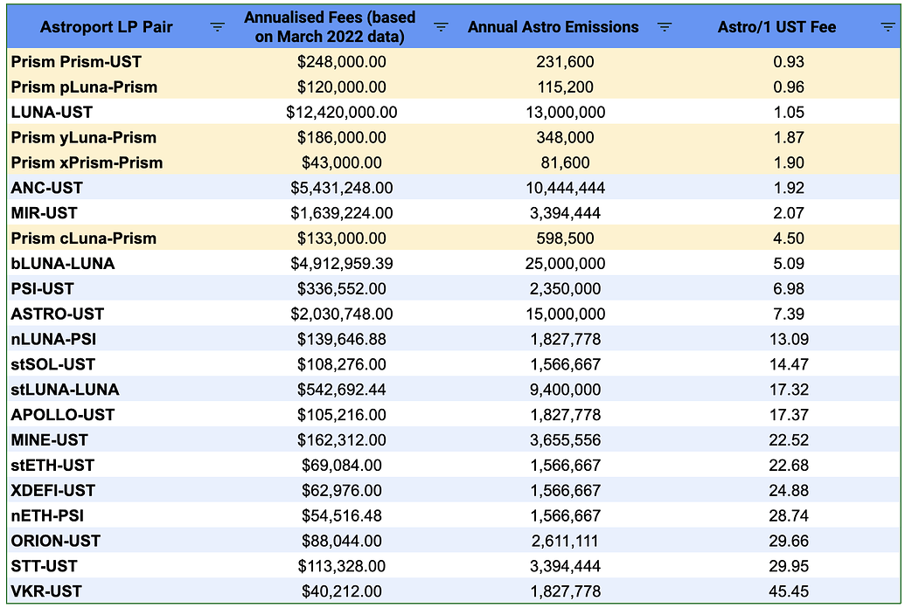

# ARC-14: Incentivise Prism Pools with ASTRO

## Preamble

```
AIP#: 14
Title: Incentivise Prism Pools with ASTRO
Author(s): @MaxCallisto
Contributors: n/a
Tags: general, generator
Type: Generator
Category: Binding (Executable Purely On-Chain)
Status: Active
Date Proposed: 2022-04-23
Date Ratified:
Dependencies: n/a
Replaces: n/a
```

## Summary

Incentivise Prism pools to build up liquidity in Astroport. The purpose of this proposal is to create deep liquidity pools of xPrism-Prism, cLuna-Luna, yLuna-Luna & pLuna-Luna outside Prismswap.

## Abstract

The purpose for creating an alternative LP outside Prismswap is to capture the fees generated from these highly traded pairs. Alternatively, this allows TWAPs of cLuna, pLuna, yLuna, xPrism can be developed for it to be accepted as a whitelisted collateral on Mars Protocol in the future.

Currently, the Prism pools in Astroport have shallow liquidity:-

1. pLuna-Luna: $477k
2. yLuna-Luna: $41k
3. cLuna-Luna: $61k
4. xPrism-Prism: $686
5. Prism-UST: $54k

Compare this against the pools at Prismswap:-

1. pLuna-Prism: $5.48mil
2. yLuna-Prism: $13.77mil
3. cLuna-Prism: $8.88mil
4. xPrism-Prism: $3.15mil
5. Prism-UST: $19.76mil

In order to provide a similar depth of liquidity, these pools will need to be incentivised with Astro emissions to attract liquidity from Prismswap to Astroport.

## Motivation

**xPrism-Prism LP**
Since Astroport is the only DEX with a stableswap invariant pool on Terra for now, this places Astroport in the prime position to provide a low slippage swap for xPrism-Prism.

In March 2022, the [xPrism-Prism LP](https://terrasco.pe/mainnet/pool/terra1czynvm64nslq2xxavzyrrhau09smvana003nrf) has seen approximately $14.32mil in volume. At 0.025% Astral fee, this equates to **$43k in annualised fees**. For a protocol less than 3 months old, this is phenomenal trading volume for a governance token. We could expect this volume to increase in the near term.

**cLuna/pLuna/yLuna-Luna LP**
Although all refracted Luna tokens in Prismswap are paired with Luna, we can still analyse the trading volume & fees accrued from the Prismswap LPs.

In March 2022, the refracted Luna LPs had trading volumes of:
1. pLuna-Prism: $10.02mil
2. yLuna-Prism: $15.49mil
3. cLuna-Prism: $11.07mil
4. Prism-UST: $20.69mil

At 0.1% Astral fee, this translates to an annualised fee of $120k (pLuna), $186k (yLuna), $133k (cLuna) & $248k (Prism).

With over $730k in annualised fees with just 5 pools, attracting liquidity with Astro tokens not only bring TVL over to Astroport, but increases the protocol revenue substantially.

## Specification

In order for us to provide a deep enough liquidity, the pools should aim to build up to total liquidity equivalent to their counterpart in Prismswap. I propose that the Astral Assembly provides Astro emissions as per the following table:

With an Astro price of $3.45 at writing, I would propose the following:

||Target TVL|Target APR|Monthly ASTRO Emissions|
| --- | --- | --- | --- |
|pLuna-Luna LP|$5mil|8%|9,600|
|yLuna-Luna LP|$15mil|8%|29,000|
|cLuna-Luna LP|$17.2mil|12%|49,875|
|xPrism-Prism LP|$3.5mil|8%|6,800|
|Prism-UST LP|$10mil|8%|19,300|
|**Total Monthly Emissions**|||114,575|

Given that Prism LP pairs generates a high trading volume, a modest monthly ASTRO allocation of 114,575 (~$395k) will bring over $730k in annualised fees, at today's Prism market rate & trading volumes. Most LPs who are provided with high ASTRO emissions do not come close to the trading volume of these LPs.

If we compare the fees generated from boosted pools vs Astro emissions:



*Based on March 2022 transaction volume.

Based on the table above and the proposed ASTRO emissions, you can see that all 5 Prism pools are extremely efficient in terms of ASTRO emission vs fees earned for Astral Assembly.

## Copyright

Copyright and related rights waived via [CC0](https://creativecommons.org/publicdomain/zero/1.0/).

*Update (23 Apr 2022): Added comparison table vs existing boosted pools & revised monthly emissions of cLuna-Luna LP to make it more competitive vs stLuna-Luna & bLuna-Luna LPs*
